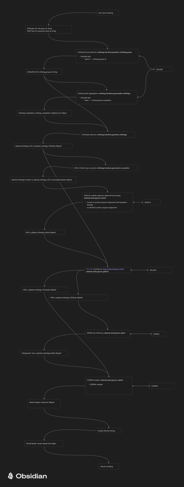

# Phylogenetic and Evolutionary Analysis Automation Logic (PEAAL) (Working Title)

This is a little pipeline project with the aim of melding existing bioinformatics tools into an automatic pipeline. In particular, running CODEML positive selection analysis on a selected gene of interest.

# Requirements:

In no particular order, you will need the following CLI tools installed (until I can containerize this stuff):
- CODEML
- pal2nal
- IQTREE3
- MUSCLE

You will also need the following python libraries:
- Requests
- Biopython

# How it works:

Heavily simplified steps:
- You specify an NCBI gene id (eg. 173042) and taxa level id (eg. 6231).
- Orthologs are retrieved from OrthoDB
- 10 nucleotide sequences (9 Orthologs + your gene) are converted to protein sequences and aligned with MUSCLE
- The MSA is converted back to nucleotides and piped into IQTREE3 to infer the tree
- The MSA and tree are fed into CODEML for positive selection analysis.

# Quickstart:

Yeah this doesn't exist yet.

# Installation:

All you need out of all these files are the python scripts in the backend-refactor folder. You can just grab those scripts and figure it out, hopefully.

Good luck.

# Next Steps

Make these scripts user friendly?
- I would like to turn this into an opensource browser application that you can just plug and play, but I'll settle for a command line tool, if I'm being honest.
- Would be nice to check if the necessary requirements are installed.

Add logic to the ortholog selection to automate *good* selections?
- At the moment, it just takes a bunch of random orthologs. 
- Ostensibly, you could make an algorithm to assess for suitability.
- Should try adding some basic paralog filtering -> if a species is included more than once in the set of orthologs, remove all associated genes.

Add containerization?
- It was a pain to install everything, I won't lie. Would not want to have to go through all of that more than once.
- Would probably allow the creation of a web app, too.

# Workflow

